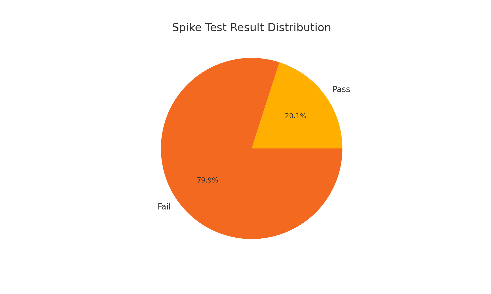

# SPIKE TEST RESULTS

## Spike Test Overview
This report documents the system behaviour under a sudden spike load scenario.

---

## Spike Load Pattern (Time vs Requests)

---

## Requests Summary (Pass vs Fail)

---

## Phase 1 - Baseline Load
- Duration: 10 seconds
- Requests Rate: 10 requests per second
- Purpose: Establish baseline system performance

## Phase 2 - Spike Load
- Duration: 60 seconds
- Requests Rate: Sudden spike to 500 requests per second
- Purpose: Evaluate system response to abrupt heavy load

---

## Execution Summary
- Total Samples: 4227
- Failed Requests: 3379
- Error Rate: 79.94%
- Successful Requests: 20.06%
- Throughput: 160.22 transactions/sec

---

## Response Time Metrics
- Average Response Time: 2578.12 ms
- Median Response Time: 2473 ms
- 90th Percentile: 5169 ms
- 95th Percentile: 5668.60 ms
- 99th Percentile: 8954.44 ms
- Maximum Response Time: 9823 ms

---

## Observations
- Severe system instability during spike phase
- Majority of failures occurred after load surged
- HTTP Request sampler failure rate: 91.57%
- System unable to recover during spike window

---

## Conclusion

System is NOT capable of handling sudden spike of 500 concurrent requests.

---

## Recommendations
- Implement auto-scaling
- Introduce rate limiting
- Increase backend processing capacity
- Use queue-based request management
